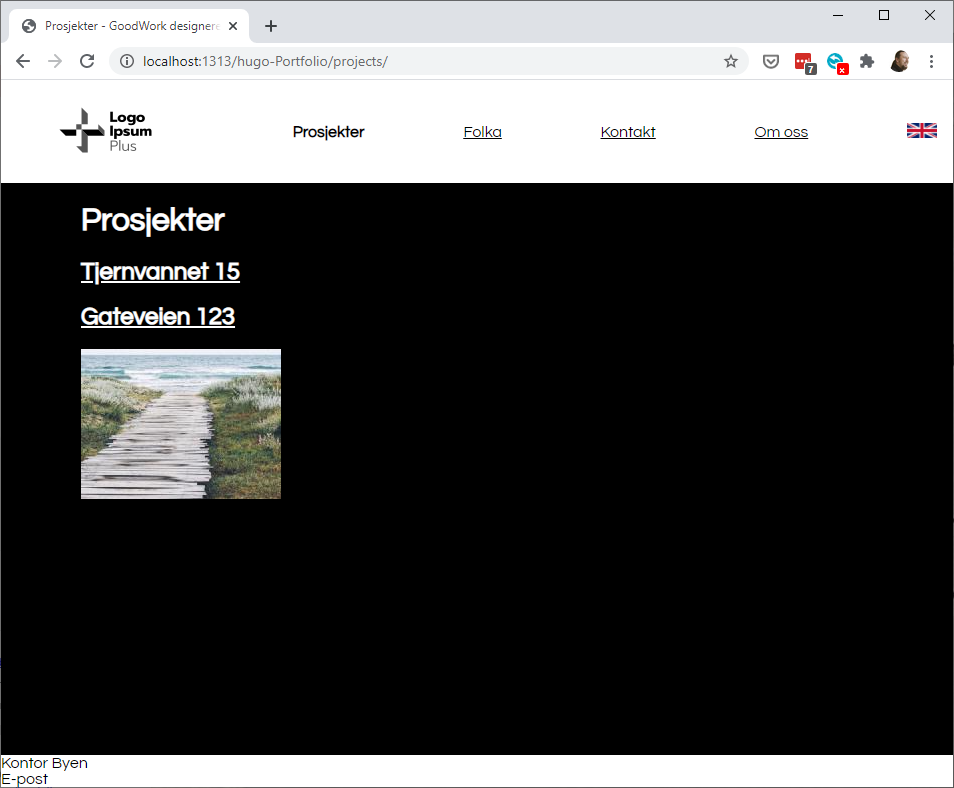

# Hugo-Portfolio theme

A theme for [Hugo](https://gohugo.io) with responsive menus and multi-language
support.

## Usage

1. Install [Hugo](https://gohugo.io/getting-started/quick-start/)
2. Create a Hugo project with some contents (`hugo new site <projectname>`)
3. Initialize git in your project (`git init`)
4. Install *Hugo-Portfolio* as a theme (`git submodule add https://github.com/jhannes/hugo-Portfolio.git themes/hugo-Portfolio`)
5. Set `theme = "hugo-Portfolio"` in `config.toml`

## Features

* Top level pages and sections are automatically added to the menu
* Responsive menu with animated hamburger/cross icon
* Automatically add translations of page in menu
* Gallery functionality

## Customizations

* Your sections (directories under `content`) will automatically show up as menu items. Add `hidden: true` in the front-matter to override
* Add `[languages.<lang>]` properties for `title` in `config.toml` to set your page title
* Add `index.<lang>.md` files for content for all languages you want to support. A language flag will appear on any page with a translation
* Supply your own `static/colors.css` to override colors and fonts
